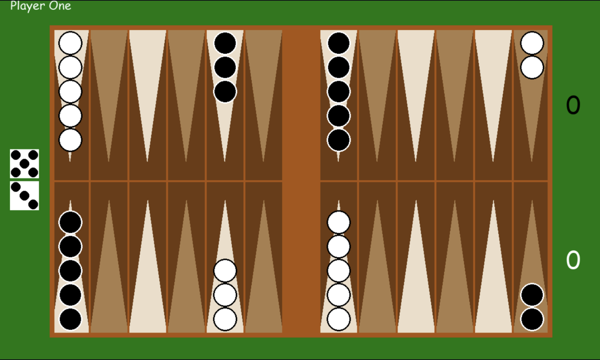

<h1 align="center">Backgammon</h1>

<h2 align="center">
    <a href="https://github.com/LandonBisson">Landon Bisson</a> |
    <a href="https://github.com/nikocalabro">Niko Calabro</a>
</h2>

## Overview

Backgammon is a two player game that can be played with two humans, human v. AI, or AI v AI for training. The goal of Backgammon is to move across a unique board, reaching and scoring all tokens into goal regions on the board.
The AI is implemented using Minimax with Alpha Beta pruning.



## Repository Structure
```
backgammon/
    ├── README.md
    └── src/
        ├── ai_player.py
        ├── board.py
        ├── constants.py
        ├── game_manager.py
        ├── human_player.py
        ├── main.py
        ├── player_base.py
        └── utilities.py

```
